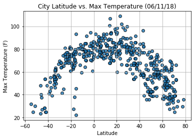
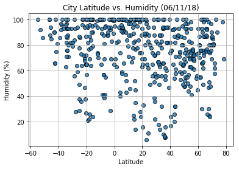
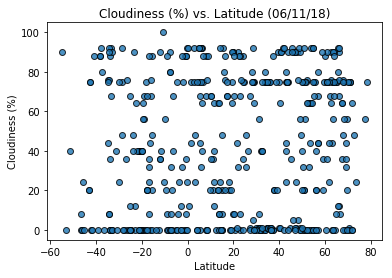
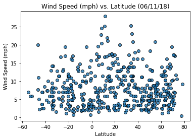

# WeatherPy

## Analysis:
* Temp near the equator is significantly higher as expected.
* Temperatures in the +ve latitudes i.e., the northern hemisphere looks significantly warmer than the southern hemisphere. Could be due to time of the year -summer.
* There is a cloudiness grouping in the latitudes: 0, 20, 70 and 90, need to look deeper into the reasons.
* Wind speed is scattered all around, does not point to any trends.


```python
import pandas as pd
import matplotlib.pyplot as plt
import numpy as np
import requests
import json
import openweathermapy.core as owm
import logging
import logging.config
import time
```


```python
from pprint import pprint
from citipy import citipy
from config import api_key
from datetime import datetime
```

### Randomly select 500 cities
#Generate 500 random latitudes and longitudes to get the 500 cities to cover the entire world.


```python
lats = np.random.randint(-90, 90, size=1500)
longs = np.random.randint(-180, 180, size=1500)
#print(type(lats))
#type(longs)
```


```python
cities = []
for x in range(1200):
    #print(f"{lats[x]},{longs[x]}")
    city = citipy.nearest_city(lats[x],longs[x])
    if(city not in cities):
        #print("Adding City = " + city.city_name)
        cities.append(city)
print(f"NUMBER = {len(cities)}")
```

    NUMBER = 543


### Get the weather details for the cities


```python
# create logger
logging.config.fileConfig('logging.conf')
logger = logging.getLogger('WeatherPy')
logger.setLevel(logging.DEBUG)
```


```python
#settings = {"units": "metric", "appid": api_key}
url = f"http://api.openweathermap.org/data/2.5/weather?units=Imperial&APPID={api_key}&q="
```

### Using APIs to get the following
* Temperature
* Humidity
* Cloudiness
* Wind Speed
* Latitude
* Longitude
* Temperature High


```python
city_name_list = []
country_name_list = []
lat_list = []
long_list = []
tempHigh_list = []
temerature_list = []
humidity_list = []
cloudiness_list = []
windSpeed_list = []
date_list = []
```


```python
# 'application' code
logger.info('Beginning Data Retrieval')
logger.info('--------------------------------')

for x in range(len(cities)):
    logger.info(f"Processing Record {x} | {cities[x].city_name},{cities[x].country_code}")
    query_url = f"{url}{cities[x].city_name},{cities[x].country_code}"
    #query_url = f"{url}belushya guba,ru"
    city_sample_list_500.append(cities[x])
    try:
        resp = requests.get(query_url).json()
        #pprint(resp)
        temerature_list.append(resp['main']['temp'])
        tempHigh_list.append(resp['main']['temp_max'])
        humidity_list.append(resp['main']['humidity'])
        cloudiness_list.append(resp['clouds']['all'])
        windSpeed_list.append(resp['wind']['speed'])
        lat_list.append(resp['coord']['lat'])
        long_list.append(resp['coord']['lon'])
        city_name_list.append(resp['name'])
        date_list.append(resp['dt'])
        country_name_list.append(resp['sys']['country'])
    except KeyError:
        logger.info(f"{resp['message']}, skipping to next city | {cities[x].city_name},{cities[x].country_code}")
```

    '06/11/2018 03:45:18 AM' - WeatherPy - INFO - Beginning Data Retrieval
    '06/11/2018 03:45:18 AM' - WeatherPy - INFO - --------------------------------
    '06/11/2018 03:45:18 AM' - WeatherPy - INFO - Processing Record 0 | obluche,ru
    '06/11/2018 03:45:18 AM' - WeatherPy - INFO - city not found, skipping to next city | obluche,ru
    '06/11/2018 03:45:18 AM' - WeatherPy - INFO - Processing Record 1 | port alfred,za
    '06/11/2018 03:45:19 AM' - WeatherPy - INFO - Processing Record 2 | georgetown,sh
    '06/11/2018 03:45:19 AM' - WeatherPy - INFO - Processing Record 3 | benghazi,ly
    '06/11/2018 03:45:19 AM' - WeatherPy - INFO - Processing Record 4 | kapaa,us
    '06/11/2018 03:45:19 AM' - WeatherPy - INFO - Processing Record 5 | rockhampton,au
    '06/11/2018 03:45:19 AM' - WeatherPy - INFO - Processing Record 6 | husavik,is
    '06/11/2018 03:45:20 AM' - WeatherPy - INFO - Processing Record 7 | rio gallegos,ar
    '06/11/2018 03:45:20 AM' - WeatherPy - INFO - Processing Record 8 | amderma,ru
    '06/11/2018 03:45:20 AM' - WeatherPy - INFO - city not found, skipping to next city | amderma,ru
    '06/11/2018 03:45:20 AM' - WeatherPy - INFO - Processing Record 9 | albany,au
    '06/11/2018 03:45:20 AM' - WeatherPy - INFO - Processing Record 10 | bartica,gy
    '06/11/2018 03:45:20 AM' - WeatherPy - INFO - Processing Record 11 | saint-philippe,re
    '06/11/2018 03:45:20 AM' - WeatherPy - INFO - Processing Record 12 | rikitea,pf
    '06/11/2018 03:45:21 AM' - WeatherPy - INFO - Processing Record 13 | new norfolk,au
    '06/11/2018 03:45:21 AM' - WeatherPy - INFO - Processing Record 14 | nikolskoye,ru
    '06/11/2018 03:45:21 AM' - WeatherPy - INFO - Processing Record 15 | dakar,sn
    '06/11/2018 03:45:21 AM' - WeatherPy - INFO - Processing Record 16 | beringovskiy,ru
    '06/11/2018 03:45:22 AM' - WeatherPy - INFO - Processing Record 17 | yulara,au
    '06/11/2018 03:45:22 AM' - WeatherPy - INFO - Processing Record 18 | yellowknife,ca
    '06/11/2018 03:45:22 AM' - WeatherPy - INFO - Processing Record 19 | corrales,pe
    '06/11/2018 03:45:22 AM' - WeatherPy - INFO - Processing Record 20 | rumoi,jp
    '06/11/2018 03:45:22 AM' - WeatherPy - INFO - Processing Record 21 | san cristobal,ec
    '06/11/2018 03:45:23 AM' - WeatherPy - INFO - Processing Record 22 | bethel,us
    '06/11/2018 03:45:23 AM' - WeatherPy - INFO - Processing Record 23 | port elizabeth,za
    '06/11/2018 03:45:23 AM' - WeatherPy - INFO - Processing Record 24 | talnakh,ru
    '06/11/2018 03:45:23 AM' - WeatherPy - INFO - Processing Record 25 | okhtyrka,ua
    '06/11/2018 03:45:23 AM' - WeatherPy - INFO - Processing Record 26 | kaura namoda,ng
    '06/11/2018 03:45:24 AM' - WeatherPy - INFO - Processing Record 27 | kodiak,us
    '06/11/2018 03:45:24 AM' - WeatherPy - INFO - Processing Record 28 | vaini,to
    '06/11/2018 03:45:24 AM' - WeatherPy - INFO - Processing Record 29 | hermanus,za
    '06/11/2018 03:45:24 AM' - WeatherPy - INFO - Processing Record 30 | mataura,pf
    '06/11/2018 03:45:24 AM' - WeatherPy - INFO - city not found, skipping to next city | mataura,pf
    '06/11/2018 03:45:24 AM' - WeatherPy - INFO - Processing Record 31 | chaochou,tw
    '06/11/2018 03:45:25 AM' - WeatherPy - INFO - city not found, skipping to next city | chaochou,tw
    '06/11/2018 03:45:25 AM' - WeatherPy - INFO - Processing Record 32 | hithadhoo,mv
    '06/11/2018 03:45:25 AM' - WeatherPy - INFO - Processing Record 33 | tiksi,ru
    '06/11/2018 03:45:25 AM' - WeatherPy - INFO - Processing Record 34 | airai,pw
    '06/11/2018 03:45:25 AM' - WeatherPy - INFO - city not found, skipping to next city | airai,pw
    '06/11/2018 03:45:25 AM' - WeatherPy - INFO - Processing Record 35 | taolanaro,mg
    '06/11/2018 03:45:25 AM' - WeatherPy - INFO - city not found, skipping to next city | taolanaro,mg
    '06/11/2018 03:45:25 AM' - WeatherPy - INFO - Processing Record 36 | east london,za
    '06/11/2018 03:45:25 AM' - WeatherPy - INFO - Processing Record 37 | srednekolymsk,ru
    '06/11/2018 03:45:26 AM' - WeatherPy - INFO - Processing Record 38 | busselton,au
    '06/11/2018 03:45:26 AM' - WeatherPy - INFO - Processing Record 39 | ushuaia,ar
    '06/11/2018 03:45:26 AM' - WeatherPy - INFO - Processing Record 40 | mildura,au
    '06/11/2018 03:45:27 AM' - WeatherPy - INFO - Processing Record 41 | norman wells,ca
    '06/11/2018 03:45:27 AM' - WeatherPy - INFO - Processing Record 42 | hobart,au
    '06/11/2018 03:45:27 AM' - WeatherPy - INFO - Processing Record 43 | punta arenas,cl
    '06/11/2018 03:45:27 AM' - WeatherPy - INFO - Processing Record 44 | barrow,us
    '06/11/2018 03:45:27 AM' - WeatherPy - INFO - Processing Record 45 | fairbanks,us
    '06/11/2018 03:45:28 AM' - WeatherPy - INFO - Processing Record 46 | dingle,ie
    '06/11/2018 03:45:28 AM' - WeatherPy - INFO - Processing Record 47 | saskylakh,ru
    '06/11/2018 03:45:28 AM' - WeatherPy - INFO - Processing Record 48 | eureka,us
    '06/11/2018 03:45:29 AM' - WeatherPy - INFO - Processing Record 49 | cherskiy,ru
    '06/11/2018 03:45:29 AM' - WeatherPy - INFO - Processing Record 50 | nishihara,jp
    '06/11/2018 03:45:29 AM' - WeatherPy - INFO - Processing Record 51 | avarua,ck
    '06/11/2018 03:45:29 AM' - WeatherPy - INFO - Processing Record 52 | geraldton,au
    '06/11/2018 03:45:29 AM' - WeatherPy - INFO - Processing Record 53 | pangnirtung,ca
    '06/11/2018 03:45:29 AM' - WeatherPy - INFO - Processing Record 54 | abu jubayhah,sd
    '06/11/2018 03:45:30 AM' - WeatherPy - INFO - city not found, skipping to next city | abu jubayhah,sd
    '06/11/2018 03:45:30 AM' - WeatherPy - INFO - Processing Record 55 | dikson,ru
    '06/11/2018 03:45:30 AM' - WeatherPy - INFO - Processing Record 56 | unguia,co
    '06/11/2018 03:45:30 AM' - WeatherPy - INFO - city not found, skipping to next city | unguia,co
    '06/11/2018 03:45:30 AM' - WeatherPy - INFO - Processing Record 57 | la ronge,ca
    '06/11/2018 03:45:30 AM' - WeatherPy - INFO - Processing Record 58 | mehamn,no
    '06/11/2018 03:45:30 AM' - WeatherPy - INFO - Processing Record 59 | ust-kamchatsk,ru
    '06/11/2018 03:45:30 AM' - WeatherPy - INFO - city not found, skipping to next city | ust-kamchatsk,ru
    '06/11/2018 03:45:30 AM' - WeatherPy - INFO - Processing Record 60 | alofi,nu
    '06/11/2018 03:45:31 AM' - WeatherPy - INFO - Processing Record 61 | tasiilaq,gl
    '06/11/2018 03:45:31 AM' - WeatherPy - INFO - Processing Record 62 | thompson,ca
    '06/11/2018 03:45:31 AM' - WeatherPy - INFO - Processing Record 63 | tasbuget,kz
    '06/11/2018 03:45:31 AM' - WeatherPy - INFO - city not found, skipping to next city | tasbuget,kz
    '06/11/2018 03:45:31 AM' - WeatherPy - INFO - Processing Record 64 | aklavik,ca
    '06/11/2018 03:45:32 AM' - WeatherPy - INFO - Processing Record 65 | upernavik,gl
    '06/11/2018 03:45:32 AM' - WeatherPy - INFO - Processing Record 66 | arraial do cabo,br
    '06/11/2018 03:45:32 AM' - WeatherPy - INFO - Processing Record 67 | ugoofaaru,mv
    '06/11/2018 03:45:32 AM' - WeatherPy - INFO - Processing Record 68 | palauig,ph
    '06/11/2018 03:45:32 AM' - WeatherPy - INFO - Processing Record 69 | barentsburg,sj
    '06/11/2018 03:45:33 AM' - WeatherPy - INFO - city not found, skipping to next city | barentsburg,sj
    '06/11/2018 03:45:33 AM' - WeatherPy - INFO - Processing Record 70 | katsuura,jp
    '06/11/2018 03:45:33 AM' - WeatherPy - INFO - Processing Record 71 | pombas,cv
    '06/11/2018 03:45:33 AM' - WeatherPy - INFO - Processing Record 72 | chuy,uy
    '06/11/2018 03:45:33 AM' - WeatherPy - INFO - Processing Record 73 | tilichiki,ru
    '06/11/2018 03:45:33 AM' - WeatherPy - INFO - Processing Record 74 | opelousas,us
    '06/11/2018 03:45:34 AM' - WeatherPy - INFO - Processing Record 75 | morant bay,jm
    '06/11/2018 03:45:34 AM' - WeatherPy - INFO - Processing Record 76 | nanortalik,gl
    '06/11/2018 03:45:34 AM' - WeatherPy - INFO - Processing Record 77 | berlevag,no
    '06/11/2018 03:45:34 AM' - WeatherPy - INFO - Processing Record 78 | butaritari,ki
    '06/11/2018 03:45:34 AM' - WeatherPy - INFO - Processing Record 79 | bredasdorp,za
    '06/11/2018 03:45:35 AM' - WeatherPy - INFO - Processing Record 80 | castanheira de pera,pt
    '06/11/2018 03:45:35 AM' - WeatherPy - INFO - Processing Record 81 | luganville,vu
    '06/11/2018 03:45:35 AM' - WeatherPy - INFO - Processing Record 82 | pyshma,ru
    '06/11/2018 03:45:35 AM' - WeatherPy - INFO - Processing Record 83 | general roca,ar
    '06/11/2018 03:45:36 AM' - WeatherPy - INFO - Processing Record 84 | saleaula,ws
    '06/11/2018 03:45:36 AM' - WeatherPy - INFO - city not found, skipping to next city | saleaula,ws
    '06/11/2018 03:45:36 AM' - WeatherPy - INFO - Processing Record 85 | bilibino,ru
    '06/11/2018 03:45:37 AM' - WeatherPy - INFO - Processing Record 86 | bambanglipuro,id
    '06/11/2018 03:45:38 AM' - WeatherPy - INFO - Processing Record 87 | bluff,nz
    '06/11/2018 03:45:38 AM' - WeatherPy - INFO - Processing Record 88 | atuona,pf
    '06/11/2018 03:45:38 AM' - WeatherPy - INFO - Processing Record 89 | mvuma,zw
    '06/11/2018 03:45:39 AM' - WeatherPy - INFO - Processing Record 90 | vardo,no
    '06/11/2018 03:45:39 AM' - WeatherPy - INFO - Processing Record 91 | opobo,ng
    '06/11/2018 03:45:39 AM' - WeatherPy - INFO - city not found, skipping to next city | opobo,ng
    '06/11/2018 03:45:39 AM' - WeatherPy - INFO - Processing Record 92 | mahebourg,mu
    '06/11/2018 03:45:39 AM' - WeatherPy - INFO - Processing Record 93 | evensk,ru
    '06/11/2018 03:45:39 AM' - WeatherPy - INFO - Processing Record 94 | rungata,ki
    '06/11/2018 03:45:39 AM' - WeatherPy - INFO - city not found, skipping to next city | rungata,ki
    '06/11/2018 03:45:39 AM' - WeatherPy - INFO - Processing Record 95 | verkhnyaya inta,ru
    '06/11/2018 03:45:40 AM' - WeatherPy - INFO - Processing Record 96 | cape town,za
    '06/11/2018 03:45:40 AM' - WeatherPy - INFO - Processing Record 97 | aripuana,br
    '06/11/2018 03:45:40 AM' - WeatherPy - INFO - Processing Record 98 | hami,cn
    '06/11/2018 03:45:40 AM' - WeatherPy - INFO - Processing Record 99 | razole,in
    '06/11/2018 03:45:40 AM' - WeatherPy - INFO - Processing Record 100 | padre bernardo,br
    '06/11/2018 03:45:41 AM' - WeatherPy - INFO - city not found, skipping to next city | padre bernardo,br
    '06/11/2018 03:45:41 AM' - WeatherPy - INFO - Processing Record 101 | ankazobe,mg
    '06/11/2018 03:45:41 AM' - WeatherPy - INFO - Processing Record 102 | kindu,cd
    '06/11/2018 03:45:41 AM' - WeatherPy - INFO - Processing Record 103 | mount gambier,au
    '06/11/2018 03:45:41 AM' - WeatherPy - INFO - Processing Record 104 | luyang,cn
    '06/11/2018 03:45:41 AM' - WeatherPy - INFO - Processing Record 105 | necochea,ar
    '06/11/2018 03:45:42 AM' - WeatherPy - INFO - Processing Record 106 | ilinskoye-khovanskoye,ru
    '06/11/2018 03:45:42 AM' - WeatherPy - INFO - Processing Record 107 | souillac,mu
    '06/11/2018 03:45:42 AM' - WeatherPy - INFO - Processing Record 108 | cidreira,br
    '06/11/2018 03:45:42 AM' - WeatherPy - INFO - Processing Record 109 | clyde river,ca
    '06/11/2018 03:45:42 AM' - WeatherPy - INFO - Processing Record 110 | santa rosalia,mx
    '06/11/2018 03:45:43 AM' - WeatherPy - INFO - Processing Record 111 | sentyabrskiy,ru
    '06/11/2018 03:45:43 AM' - WeatherPy - INFO - city not found, skipping to next city | sentyabrskiy,ru
    '06/11/2018 03:45:43 AM' - WeatherPy - INFO - Processing Record 112 | hirara,jp
    '06/11/2018 03:45:43 AM' - WeatherPy - INFO - Processing Record 113 | lompoc,us
    '06/11/2018 03:45:43 AM' - WeatherPy - INFO - Processing Record 114 | ponta delgada,pt
    '06/11/2018 03:45:43 AM' - WeatherPy - INFO - Processing Record 115 | jamestown,sh
    '06/11/2018 03:45:44 AM' - WeatherPy - INFO - Processing Record 116 | requena,pe
    '06/11/2018 03:45:44 AM' - WeatherPy - INFO - city not found, skipping to next city | requena,pe
    '06/11/2018 03:45:44 AM' - WeatherPy - INFO - Processing Record 117 | khorixas,na
    '06/11/2018 03:45:44 AM' - WeatherPy - INFO - Processing Record 118 | vao,nc
    '06/11/2018 03:45:44 AM' - WeatherPy - INFO - Processing Record 119 | umzimvubu,za
    '06/11/2018 03:45:44 AM' - WeatherPy - INFO - city not found, skipping to next city | umzimvubu,za
    '06/11/2018 03:45:44 AM' - WeatherPy - INFO - Processing Record 120 | sao filipe,cv
    '06/11/2018 03:45:45 AM' - WeatherPy - INFO - Processing Record 121 | rocha,uy
    '06/11/2018 03:45:45 AM' - WeatherPy - INFO - Processing Record 122 | svobodnyy,ru
    '06/11/2018 03:45:45 AM' - WeatherPy - INFO - Processing Record 123 | torbay,ca
    '06/11/2018 03:45:45 AM' - WeatherPy - INFO - Processing Record 124 | bengkulu,id
    '06/11/2018 03:45:45 AM' - WeatherPy - INFO - city not found, skipping to next city | bengkulu,id
    '06/11/2018 03:45:45 AM' - WeatherPy - INFO - Processing Record 125 | hilo,us
    '06/11/2018 03:45:46 AM' - WeatherPy - INFO - Processing Record 126 | urdzhar,kz
    '06/11/2018 03:45:46 AM' - WeatherPy - INFO - city not found, skipping to next city | urdzhar,kz
    '06/11/2018 03:45:46 AM' - WeatherPy - INFO - Processing Record 127 | praia,cv
    '06/11/2018 03:45:46 AM' - WeatherPy - INFO - Processing Record 128 | votkinsk,ru
    '06/11/2018 03:45:46 AM' - WeatherPy - INFO - Processing Record 129 | slantsy,ru
    '06/11/2018 03:45:46 AM' - WeatherPy - INFO - Processing Record 130 | vila franca do campo,pt
    '06/11/2018 03:45:47 AM' - WeatherPy - INFO - Processing Record 131 | touros,br
    '06/11/2018 03:45:47 AM' - WeatherPy - INFO - Processing Record 132 | gagnoa,ci
    '06/11/2018 03:45:47 AM' - WeatherPy - INFO - Processing Record 133 | vestmannaeyjar,is
    '06/11/2018 03:45:47 AM' - WeatherPy - INFO - Processing Record 134 | kruisfontein,za
    '06/11/2018 03:45:47 AM' - WeatherPy - INFO - Processing Record 135 | qaanaaq,gl
    '06/11/2018 03:45:48 AM' - WeatherPy - INFO - Processing Record 136 | moroni,km
    '06/11/2018 03:45:48 AM' - WeatherPy - INFO - Processing Record 137 | leningradskiy,tj
    '06/11/2018 03:45:48 AM' - WeatherPy - INFO - city not found, skipping to next city | leningradskiy,tj
    '06/11/2018 03:45:48 AM' - WeatherPy - INFO - Processing Record 138 | mar del plata,ar
    '06/11/2018 03:45:48 AM' - WeatherPy - INFO - Processing Record 139 | uwayl,sd
    '06/11/2018 03:45:48 AM' - WeatherPy - INFO - city not found, skipping to next city | uwayl,sd
    '06/11/2018 03:45:48 AM' - WeatherPy - INFO - Processing Record 140 | illoqqortoormiut,gl
    '06/11/2018 03:45:49 AM' - WeatherPy - INFO - city not found, skipping to next city | illoqqortoormiut,gl
    '06/11/2018 03:45:49 AM' - WeatherPy - INFO - Processing Record 141 | lethem,gy
    '06/11/2018 03:45:49 AM' - WeatherPy - INFO - Processing Record 142 | ayan,ru
    '06/11/2018 03:45:49 AM' - WeatherPy - INFO - city not found, skipping to next city | ayan,ru
    '06/11/2018 03:45:49 AM' - WeatherPy - INFO - Processing Record 143 | deer lake,ca
    '06/11/2018 03:45:49 AM' - WeatherPy - INFO - Processing Record 144 | jimenez,mx
    '06/11/2018 03:45:49 AM' - WeatherPy - INFO - Processing Record 145 | badarganj,bd
    '06/11/2018 03:45:50 AM' - WeatherPy - INFO - Processing Record 146 | tuktoyaktuk,ca
    '06/11/2018 03:45:50 AM' - WeatherPy - INFO - Processing Record 147 | mabaruma,gy
    '06/11/2018 03:45:50 AM' - WeatherPy - INFO - Processing Record 148 | chokurdakh,ru
    '06/11/2018 03:45:50 AM' - WeatherPy - INFO - Processing Record 149 | luderitz,na
    '06/11/2018 03:45:50 AM' - WeatherPy - INFO - Processing Record 150 | de-kastri,ru
    '06/11/2018 03:45:51 AM' - WeatherPy - INFO - Processing Record 151 | vaitupu,wf
    '06/11/2018 03:45:51 AM' - WeatherPy - INFO - city not found, skipping to next city | vaitupu,wf
    '06/11/2018 03:45:51 AM' - WeatherPy - INFO - Processing Record 152 | luanda,ao
    '06/11/2018 03:45:51 AM' - WeatherPy - INFO - Processing Record 153 | cordoba,ar
    '06/11/2018 03:45:51 AM' - WeatherPy - INFO - Processing Record 154 | severo-kurilsk,ru
    '06/11/2018 03:45:51 AM' - WeatherPy - INFO - Processing Record 155 | teguise,es
    '06/11/2018 03:45:52 AM' - WeatherPy - INFO - Processing Record 156 | macroom,ie
    '06/11/2018 03:45:52 AM' - WeatherPy - INFO - Processing Record 157 | provideniya,ru
    '06/11/2018 03:45:52 AM' - WeatherPy - INFO - Processing Record 158 | talcahuano,cl
    '06/11/2018 03:45:52 AM' - WeatherPy - INFO - Processing Record 159 | ilulissat,gl
    '06/11/2018 03:45:53 AM' - WeatherPy - INFO - Processing Record 160 | naryan-mar,ru
    '06/11/2018 03:45:53 AM' - WeatherPy - INFO - Processing Record 161 | juegang,cn
    '06/11/2018 03:45:53 AM' - WeatherPy - INFO - Processing Record 162 | new richmond,ca
    '06/11/2018 03:45:53 AM' - WeatherPy - INFO - Processing Record 163 | santa marta,co
    '06/11/2018 03:45:54 AM' - WeatherPy - INFO - Processing Record 164 | kargapolye,ru
    '06/11/2018 03:45:54 AM' - WeatherPy - INFO - city not found, skipping to next city | kargapolye,ru
    '06/11/2018 03:45:54 AM' - WeatherPy - INFO - Processing Record 165 | trincomalee,lk
    '06/11/2018 03:45:54 AM' - WeatherPy - INFO - Processing Record 166 | mumford,gh
    '06/11/2018 03:45:54 AM' - WeatherPy - INFO - Processing Record 167 | marcona,pe
    '06/11/2018 03:45:54 AM' - WeatherPy - INFO - city not found, skipping to next city | marcona,pe
    '06/11/2018 03:45:54 AM' - WeatherPy - INFO - Processing Record 168 | marsa matruh,eg
    '06/11/2018 03:45:54 AM' - WeatherPy - INFO - Processing Record 169 | stranraer,gb
    '06/11/2018 03:45:55 AM' - WeatherPy - INFO - Processing Record 170 | tuy hoa,vn
    '06/11/2018 03:45:55 AM' - WeatherPy - INFO - Processing Record 171 | kidal,ml
    '06/11/2018 03:45:55 AM' - WeatherPy - INFO - Processing Record 172 | pevek,ru
    '06/11/2018 03:45:55 AM' - WeatherPy - INFO - Processing Record 173 | samusu,ws
    '06/11/2018 03:45:55 AM' - WeatherPy - INFO - city not found, skipping to next city | samusu,ws
    '06/11/2018 03:45:55 AM' - WeatherPy - INFO - Processing Record 174 | banda aceh,id
    '06/11/2018 03:45:56 AM' - WeatherPy - INFO - Processing Record 175 | guerrero negro,mx
    '06/11/2018 03:45:56 AM' - WeatherPy - INFO - Processing Record 176 | acarau,br
    '06/11/2018 03:45:56 AM' - WeatherPy - INFO - city not found, skipping to next city | acarau,br
    '06/11/2018 03:45:56 AM' - WeatherPy - INFO - Processing Record 177 | bambous virieux,mu
    '06/11/2018 03:45:56 AM' - WeatherPy - INFO - Processing Record 178 | mount darwin,zw
    '06/11/2018 03:45:56 AM' - WeatherPy - INFO - Processing Record 179 | lebu,cl
    '06/11/2018 03:45:57 AM' - WeatherPy - INFO - Processing Record 180 | nome,us
    '06/11/2018 03:45:57 AM' - WeatherPy - INFO - Processing Record 181 | trelew,ar
    '06/11/2018 03:45:57 AM' - WeatherPy - INFO - Processing Record 182 | pochutla,mx
    '06/11/2018 03:45:57 AM' - WeatherPy - INFO - Processing Record 183 | sao gabriel da cachoeira,br
    '06/11/2018 03:45:57 AM' - WeatherPy - INFO - Processing Record 184 | waingapu,id
    '06/11/2018 03:45:58 AM' - WeatherPy - INFO - Processing Record 185 | smiths falls,ca
    '06/11/2018 03:45:58 AM' - WeatherPy - INFO - Processing Record 186 | asosa,et
    '06/11/2018 03:45:58 AM' - WeatherPy - INFO - Processing Record 187 | poyarkovo,ru
    '06/11/2018 03:45:58 AM' - WeatherPy - INFO - Processing Record 188 | hobyo,so
    '06/11/2018 03:45:58 AM' - WeatherPy - INFO - Processing Record 189 | bonavista,ca
    '06/11/2018 03:45:59 AM' - WeatherPy - INFO - Processing Record 190 | kawalu,id
    '06/11/2018 03:45:59 AM' - WeatherPy - INFO - Processing Record 191 | port hardy,ca
    '06/11/2018 03:45:59 AM' - WeatherPy - INFO - Processing Record 192 | fortuna,us
    '06/11/2018 03:45:59 AM' - WeatherPy - INFO - Processing Record 193 | srednyaya yelyuzan,ru
    '06/11/2018 03:46:00 AM' - WeatherPy - INFO - Processing Record 194 | bathsheba,bb
    '06/11/2018 03:46:00 AM' - WeatherPy - INFO - Processing Record 195 | chumikan,ru
    '06/11/2018 03:46:00 AM' - WeatherPy - INFO - Processing Record 196 | hailar,cn
    '06/11/2018 03:46:00 AM' - WeatherPy - INFO - Processing Record 197 | moron,mn
    '06/11/2018 03:46:00 AM' - WeatherPy - INFO - Processing Record 198 | surt,ly
    '06/11/2018 03:46:01 AM' - WeatherPy - INFO - Processing Record 199 | faanui,pf
    '06/11/2018 03:46:01 AM' - WeatherPy - INFO - Processing Record 200 | edd,er
    '06/11/2018 03:46:01 AM' - WeatherPy - INFO - Processing Record 201 | san mateo del mar,mx
    '06/11/2018 03:46:01 AM' - WeatherPy - INFO - Processing Record 202 | sept-iles,ca
    '06/11/2018 03:46:01 AM' - WeatherPy - INFO - Processing Record 203 | galiwinku,au
    '06/11/2018 03:46:02 AM' - WeatherPy - INFO - city not found, skipping to next city | galiwinku,au
    '06/11/2018 03:46:02 AM' - WeatherPy - INFO - Processing Record 204 | bonfim,br
    '06/11/2018 03:46:02 AM' - WeatherPy - INFO - Processing Record 205 | nsanje,mw
    '06/11/2018 03:46:02 AM' - WeatherPy - INFO - Processing Record 206 | nnewi,ng
    '06/11/2018 03:46:02 AM' - WeatherPy - INFO - Processing Record 207 | tumannyy,ru
    '06/11/2018 03:46:03 AM' - WeatherPy - INFO - city not found, skipping to next city | tumannyy,ru
    '06/11/2018 03:46:03 AM' - WeatherPy - INFO - Processing Record 208 | bur gabo,so
    '06/11/2018 03:46:03 AM' - WeatherPy - INFO - city not found, skipping to next city | bur gabo,so
    '06/11/2018 03:46:03 AM' - WeatherPy - INFO - Processing Record 209 | kaputa,zm
    '06/11/2018 03:46:03 AM' - WeatherPy - INFO - Processing Record 210 | havoysund,no
    '06/11/2018 03:46:03 AM' - WeatherPy - INFO - Processing Record 211 | carnarvon,au
    '06/11/2018 03:46:03 AM' - WeatherPy - INFO - Processing Record 212 | stulovo,ru
    '06/11/2018 03:46:04 AM' - WeatherPy - INFO - Processing Record 213 | mys shmidta,ru
    '06/11/2018 03:46:04 AM' - WeatherPy - INFO - city not found, skipping to next city | mys shmidta,ru
    '06/11/2018 03:46:04 AM' - WeatherPy - INFO - Processing Record 214 | port macquarie,au
    '06/11/2018 03:46:04 AM' - WeatherPy - INFO - Processing Record 215 | saldanha,za
    '06/11/2018 03:46:04 AM' - WeatherPy - INFO - Processing Record 216 | iqaluit,ca
    '06/11/2018 03:46:04 AM' - WeatherPy - INFO - Processing Record 217 | xuddur,so
    '06/11/2018 03:46:05 AM' - WeatherPy - INFO - Processing Record 218 | bowen,au
    '06/11/2018 03:46:05 AM' - WeatherPy - INFO - Processing Record 219 | tomatlan,mx
    '06/11/2018 03:46:05 AM' - WeatherPy - INFO - Processing Record 220 | kudat,my
    '06/11/2018 03:46:05 AM' - WeatherPy - INFO - Processing Record 221 | longyearbyen,sj
    '06/11/2018 03:46:05 AM' - WeatherPy - INFO - Processing Record 222 | agidel,ru
    '06/11/2018 03:46:05 AM' - WeatherPy - INFO - Processing Record 223 | matara,lk
    '06/11/2018 03:46:06 AM' - WeatherPy - INFO - Processing Record 224 | quatre cocos,mu
    '06/11/2018 03:46:06 AM' - WeatherPy - INFO - Processing Record 225 | kazalinsk,kz
    '06/11/2018 03:46:06 AM' - WeatherPy - INFO - city not found, skipping to next city | kazalinsk,kz
    '06/11/2018 03:46:06 AM' - WeatherPy - INFO - Processing Record 226 | margate,za
    '06/11/2018 03:46:06 AM' - WeatherPy - INFO - Processing Record 227 | dolbeau,ca
    '06/11/2018 03:46:06 AM' - WeatherPy - INFO - city not found, skipping to next city | dolbeau,ca
    '06/11/2018 03:46:06 AM' - WeatherPy - INFO - Processing Record 228 | lakselv,no
    '06/11/2018 03:46:07 AM' - WeatherPy - INFO - Processing Record 229 | rio bravo,mx
    '06/11/2018 03:46:07 AM' - WeatherPy - INFO - Processing Record 230 | jacmel,ht
    '06/11/2018 03:46:07 AM' - WeatherPy - INFO - Processing Record 231 | batagay,ru
    '06/11/2018 03:46:07 AM' - WeatherPy - INFO - Processing Record 232 | dukat,ru
    '06/11/2018 03:46:08 AM' - WeatherPy - INFO - Processing Record 233 | burica,pa
    '06/11/2018 03:46:08 AM' - WeatherPy - INFO - city not found, skipping to next city | burica,pa
    '06/11/2018 03:46:08 AM' - WeatherPy - INFO - Processing Record 234 | kaitangata,nz
    '06/11/2018 03:46:08 AM' - WeatherPy - INFO - Processing Record 235 | sahrak,af
    '06/11/2018 03:46:08 AM' - WeatherPy - INFO - city not found, skipping to next city | sahrak,af
    '06/11/2018 03:46:08 AM' - WeatherPy - INFO - Processing Record 236 | luwuk,id
    '06/11/2018 03:46:08 AM' - WeatherPy - INFO - Processing Record 237 | keti bandar,pk
    '06/11/2018 03:46:08 AM' - WeatherPy - INFO - Processing Record 238 | sembe,cg
    '06/11/2018 03:46:09 AM' - WeatherPy - INFO - Processing Record 239 | okha,ru
    '06/11/2018 03:46:09 AM' - WeatherPy - INFO - Processing Record 240 | lena,es
    '06/11/2018 03:46:09 AM' - WeatherPy - INFO - Processing Record 241 | alexandria,eg
    '06/11/2018 03:46:09 AM' - WeatherPy - INFO - Processing Record 242 | puri,in
    '06/11/2018 03:46:09 AM' - WeatherPy - INFO - Processing Record 243 | sunrise manor,us
    '06/11/2018 03:46:10 AM' - WeatherPy - INFO - Processing Record 244 | gandajika,cd
    '06/11/2018 03:46:10 AM' - WeatherPy - INFO - Processing Record 245 | port blair,in
    '06/11/2018 03:46:10 AM' - WeatherPy - INFO - Processing Record 246 | indian head,ca
    '06/11/2018 03:46:10 AM' - WeatherPy - INFO - Processing Record 247 | ribeira grande,pt
    '06/11/2018 03:46:10 AM' - WeatherPy - INFO - Processing Record 248 | umm kaddadah,sd
    '06/11/2018 03:46:11 AM' - WeatherPy - INFO - Processing Record 249 | tautira,pf
    '06/11/2018 03:46:11 AM' - WeatherPy - INFO - Processing Record 250 | lincoln,ar
    '06/11/2018 03:46:11 AM' - WeatherPy - INFO - Processing Record 251 | loveland,us
    '06/11/2018 03:46:11 AM' - WeatherPy - INFO - Processing Record 252 | puerto ayora,ec
    '06/11/2018 03:46:12 AM' - WeatherPy - INFO - Processing Record 253 | san joaquin,bo
    '06/11/2018 03:46:12 AM' - WeatherPy - INFO - Processing Record 254 | bud,no
    '06/11/2018 03:46:12 AM' - WeatherPy - INFO - Processing Record 255 | iquique,cl
    '06/11/2018 03:46:12 AM' - WeatherPy - INFO - Processing Record 256 | kuching,my
    '06/11/2018 03:46:13 AM' - WeatherPy - INFO - Processing Record 257 | sergeyevka,kz
    '06/11/2018 03:46:13 AM' - WeatherPy - INFO - Processing Record 258 | kavieng,pg
    '06/11/2018 03:46:13 AM' - WeatherPy - INFO - Processing Record 259 | copperas cove,us
    '06/11/2018 03:46:13 AM' - WeatherPy - INFO - Processing Record 260 | cochrane,ca
    '06/11/2018 03:46:13 AM' - WeatherPy - INFO - Processing Record 261 | chiang klang,th
    '06/11/2018 03:46:14 AM' - WeatherPy - INFO - Processing Record 262 | esperance,au
    '06/11/2018 03:46:14 AM' - WeatherPy - INFO - Processing Record 263 | isabela,us
    '06/11/2018 03:46:14 AM' - WeatherPy - INFO - city not found, skipping to next city | isabela,us
    '06/11/2018 03:46:14 AM' - WeatherPy - INFO - Processing Record 264 | yabrud,sy
    '06/11/2018 03:46:14 AM' - WeatherPy - INFO - Processing Record 265 | usinsk,ru
    '06/11/2018 03:46:14 AM' - WeatherPy - INFO - Processing Record 266 | kununurra,au
    '06/11/2018 03:46:15 AM' - WeatherPy - INFO - Processing Record 267 | laurel,us
    '06/11/2018 03:46:15 AM' - WeatherPy - INFO - Processing Record 268 | bekasi,id
    '06/11/2018 03:46:15 AM' - WeatherPy - INFO - Processing Record 269 | caravelas,br
    '06/11/2018 03:46:15 AM' - WeatherPy - INFO - Processing Record 270 | hunza,pk
    '06/11/2018 03:46:15 AM' - WeatherPy - INFO - city not found, skipping to next city | hunza,pk
    '06/11/2018 03:46:15 AM' - WeatherPy - INFO - Processing Record 271 | baie-comeau,ca
    '06/11/2018 03:46:16 AM' - WeatherPy - INFO - Processing Record 272 | klaksvik,fo
    '06/11/2018 03:46:16 AM' - WeatherPy - INFO - Processing Record 273 | ishigaki,jp
    '06/11/2018 03:46:16 AM' - WeatherPy - INFO - Processing Record 274 | ozernovskiy,ru
    '06/11/2018 03:46:16 AM' - WeatherPy - INFO - Processing Record 275 | beloha,mg
    '06/11/2018 03:46:17 AM' - WeatherPy - INFO - Processing Record 276 | castro,cl
    '06/11/2018 03:46:17 AM' - WeatherPy - INFO - Processing Record 277 | grand river south east,mu
    '06/11/2018 03:46:17 AM' - WeatherPy - INFO - city not found, skipping to next city | grand river south east,mu
    '06/11/2018 03:46:17 AM' - WeatherPy - INFO - Processing Record 278 | khonuu,ru
    '06/11/2018 03:46:17 AM' - WeatherPy - INFO - city not found, skipping to next city | khonuu,ru
    '06/11/2018 03:46:17 AM' - WeatherPy - INFO - Processing Record 279 | acajutla,sv
    '06/11/2018 03:46:17 AM' - WeatherPy - INFO - Processing Record 280 | boralday,kz
    '06/11/2018 03:46:17 AM' - WeatherPy - INFO - Processing Record 281 | gurskoye,ru
    '06/11/2018 03:46:18 AM' - WeatherPy - INFO - city not found, skipping to next city | gurskoye,ru
    '06/11/2018 03:46:18 AM' - WeatherPy - INFO - Processing Record 282 | whitehorse,ca
    '06/11/2018 03:46:18 AM' - WeatherPy - INFO - Processing Record 283 | nizwa,om
    '06/11/2018 03:46:18 AM' - WeatherPy - INFO - Processing Record 284 | zhigansk,ru
    '06/11/2018 03:46:18 AM' - WeatherPy - INFO - Processing Record 285 | hamilton,bm
    '06/11/2018 03:46:18 AM' - WeatherPy - INFO - Processing Record 286 | labuhan,id
    '06/11/2018 03:46:19 AM' - WeatherPy - INFO - Processing Record 287 | hambantota,lk
    '06/11/2018 03:46:19 AM' - WeatherPy - INFO - Processing Record 288 | minab,ir
    '06/11/2018 03:46:19 AM' - WeatherPy - INFO - Processing Record 289 | attawapiskat,ca
    '06/11/2018 03:46:19 AM' - WeatherPy - INFO - city not found, skipping to next city | attawapiskat,ca
    '06/11/2018 03:46:19 AM' - WeatherPy - INFO - Processing Record 290 | coquimbo,cl
    '06/11/2018 03:46:20 AM' - WeatherPy - INFO - Processing Record 291 | nadym,ru
    '06/11/2018 03:46:20 AM' - WeatherPy - INFO - Processing Record 292 | sun valley,us
    '06/11/2018 03:46:20 AM' - WeatherPy - INFO - Processing Record 293 | jacareacanga,br
    '06/11/2018 03:46:20 AM' - WeatherPy - INFO - Processing Record 294 | ancud,cl
    '06/11/2018 03:46:20 AM' - WeatherPy - INFO - Processing Record 295 | hasaki,jp
    '06/11/2018 03:46:21 AM' - WeatherPy - INFO - Processing Record 296 | karur,in
    '06/11/2018 03:46:21 AM' - WeatherPy - INFO - Processing Record 297 | bubaque,gw
    '06/11/2018 03:46:21 AM' - WeatherPy - INFO - Processing Record 298 | tanout,ne
    '06/11/2018 03:46:21 AM' - WeatherPy - INFO - Processing Record 299 | epernay,fr
    '06/11/2018 03:46:22 AM' - WeatherPy - INFO - Processing Record 300 | el tigre,ve
    '06/11/2018 03:46:22 AM' - WeatherPy - INFO - Processing Record 301 | omboue,ga
    '06/11/2018 03:46:22 AM' - WeatherPy - INFO - Processing Record 302 | yining,cn
    '06/11/2018 03:46:22 AM' - WeatherPy - INFO - Processing Record 303 | san patricio,mx
    '06/11/2018 03:46:22 AM' - WeatherPy - INFO - Processing Record 304 | almaty,kz
    '06/11/2018 03:46:23 AM' - WeatherPy - INFO - Processing Record 305 | kango,ga
    '06/11/2018 03:46:23 AM' - WeatherPy - INFO - Processing Record 306 | tsuyama,jp
    '06/11/2018 03:46:23 AM' - WeatherPy - INFO - Processing Record 307 | lewiston,us
    '06/11/2018 03:46:23 AM' - WeatherPy - INFO - Processing Record 308 | sorland,no
    '06/11/2018 03:46:24 AM' - WeatherPy - INFO - Processing Record 309 | zhireken,ru
    '06/11/2018 03:46:24 AM' - WeatherPy - INFO - Processing Record 310 | tabiauea,ki
    '06/11/2018 03:46:24 AM' - WeatherPy - INFO - city not found, skipping to next city | tabiauea,ki
    '06/11/2018 03:46:24 AM' - WeatherPy - INFO - Processing Record 311 | cabra,ph
    '06/11/2018 03:46:24 AM' - WeatherPy - INFO - Processing Record 312 | cabo san lucas,mx
    '06/11/2018 03:46:24 AM' - WeatherPy - INFO - Processing Record 313 | yenagoa,ng
    '06/11/2018 03:46:24 AM' - WeatherPy - INFO - Processing Record 314 | haines junction,ca
    '06/11/2018 03:46:25 AM' - WeatherPy - INFO - Processing Record 315 | kotma,in
    '06/11/2018 03:46:25 AM' - WeatherPy - INFO - Processing Record 316 | victoria,sc
    '06/11/2018 03:46:25 AM' - WeatherPy - INFO - Processing Record 317 | sayyan,ye
    '06/11/2018 03:46:25 AM' - WeatherPy - INFO - Processing Record 318 | tatsuno,jp
    '06/11/2018 03:46:26 AM' - WeatherPy - INFO - Processing Record 319 | moses lake,us
    '06/11/2018 03:46:26 AM' - WeatherPy - INFO - Processing Record 320 | caucasia,co
    '06/11/2018 03:46:26 AM' - WeatherPy - INFO - Processing Record 321 | hrubieszow,pl
    '06/11/2018 03:46:26 AM' - WeatherPy - INFO - Processing Record 322 | linhares,br
    '06/11/2018 03:46:27 AM' - WeatherPy - INFO - Processing Record 323 | hede,cn
    '06/11/2018 03:46:27 AM' - WeatherPy - INFO - Processing Record 324 | noumea,nc
    '06/11/2018 03:46:27 AM' - WeatherPy - INFO - Processing Record 325 | goderich,sl
    '06/11/2018 03:46:27 AM' - WeatherPy - INFO - city not found, skipping to next city | goderich,sl
    '06/11/2018 03:46:27 AM' - WeatherPy - INFO - Processing Record 326 | hun,ly
    '06/11/2018 03:46:27 AM' - WeatherPy - INFO - Processing Record 327 | santa isabel do rio negro,br
    '06/11/2018 03:46:28 AM' - WeatherPy - INFO - Processing Record 328 | constitucion,mx
    '06/11/2018 03:46:28 AM' - WeatherPy - INFO - Processing Record 329 | benguela,ao
    '06/11/2018 03:46:28 AM' - WeatherPy - INFO - Processing Record 330 | naze,jp
    '06/11/2018 03:46:28 AM' - WeatherPy - INFO - Processing Record 331 | rawson,ar
    '06/11/2018 03:46:28 AM' - WeatherPy - INFO - Processing Record 332 | semirom,ir
    '06/11/2018 03:46:29 AM' - WeatherPy - INFO - Processing Record 333 | trojes,hn
    '06/11/2018 03:46:29 AM' - WeatherPy - INFO - Processing Record 334 | bernalillo,us
    '06/11/2018 03:46:29 AM' - WeatherPy - INFO - Processing Record 335 | esmeraldas,ec
    '06/11/2018 03:46:29 AM' - WeatherPy - INFO - Processing Record 336 | salinopolis,br
    '06/11/2018 03:46:29 AM' - WeatherPy - INFO - Processing Record 337 | norsup,vu
    '06/11/2018 03:46:30 AM' - WeatherPy - INFO - Processing Record 338 | egvekinot,ru
    '06/11/2018 03:46:30 AM' - WeatherPy - INFO - Processing Record 339 | cayenne,gf
    '06/11/2018 03:46:30 AM' - WeatherPy - INFO - Processing Record 340 | namtsy,ru
    '06/11/2018 03:46:30 AM' - WeatherPy - INFO - Processing Record 341 | belaya gora,ru
    '06/11/2018 03:46:31 AM' - WeatherPy - INFO - Processing Record 342 | tsihombe,mg
    '06/11/2018 03:46:31 AM' - WeatherPy - INFO - city not found, skipping to next city | tsihombe,mg
    '06/11/2018 03:46:31 AM' - WeatherPy - INFO - Processing Record 343 | henderson,us
    '06/11/2018 03:46:31 AM' - WeatherPy - INFO - Processing Record 344 | nemuro,jp
    '06/11/2018 03:46:31 AM' - WeatherPy - INFO - Processing Record 345 | acari,pe
    '06/11/2018 03:46:31 AM' - WeatherPy - INFO - Processing Record 346 | yatou,cn
    '06/11/2018 03:46:32 AM' - WeatherPy - INFO - Processing Record 347 | linjiang,cn
    '06/11/2018 03:46:32 AM' - WeatherPy - INFO - Processing Record 348 | longlac,ca
    '06/11/2018 03:46:32 AM' - WeatherPy - INFO - city not found, skipping to next city | longlac,ca
    '06/11/2018 03:46:32 AM' - WeatherPy - INFO - Processing Record 349 | aljezur,pt
    '06/11/2018 03:46:32 AM' - WeatherPy - INFO - Processing Record 350 | muhos,fi
    '06/11/2018 03:46:32 AM' - WeatherPy - INFO - Processing Record 351 | los llanos de aridane,es
    '06/11/2018 03:46:33 AM' - WeatherPy - INFO - Processing Record 352 | lakshmipur,bd
    '06/11/2018 03:46:33 AM' - WeatherPy - INFO - Processing Record 353 | imbituba,br
    '06/11/2018 03:46:33 AM' - WeatherPy - INFO - Processing Record 354 | dunedin,nz
    '06/11/2018 03:46:33 AM' - WeatherPy - INFO - Processing Record 355 | kisangani,cd
    '06/11/2018 03:46:33 AM' - WeatherPy - INFO - Processing Record 356 | yanan,cn
    '06/11/2018 03:46:33 AM' - WeatherPy - INFO - city not found, skipping to next city | yanan,cn
    '06/11/2018 03:46:33 AM' - WeatherPy - INFO - Processing Record 357 | diego de almagro,cl
    '06/11/2018 03:46:34 AM' - WeatherPy - INFO - Processing Record 358 | viedma,ar
    '06/11/2018 03:46:34 AM' - WeatherPy - INFO - Processing Record 359 | marzuq,ly
    '06/11/2018 03:46:34 AM' - WeatherPy - INFO - city not found, skipping to next city | marzuq,ly
    '06/11/2018 03:46:34 AM' - WeatherPy - INFO - Processing Record 360 | khatanga,ru
    '06/11/2018 03:46:34 AM' - WeatherPy - INFO - Processing Record 361 | avera,pf
    '06/11/2018 03:46:35 AM' - WeatherPy - INFO - city not found, skipping to next city | avera,pf
    '06/11/2018 03:46:35 AM' - WeatherPy - INFO - Processing Record 362 | atar,mr
    '06/11/2018 03:46:35 AM' - WeatherPy - INFO - Processing Record 363 | komsomolskiy,ru
    '06/11/2018 03:46:35 AM' - WeatherPy - INFO - Processing Record 364 | bakchar,ru
    '06/11/2018 03:46:36 AM' - WeatherPy - INFO - Processing Record 365 | palabuhanratu,id
    '06/11/2018 03:46:36 AM' - WeatherPy - INFO - city not found, skipping to next city | palabuhanratu,id
    '06/11/2018 03:46:36 AM' - WeatherPy - INFO - Processing Record 366 | baixa grande,br
    '06/11/2018 03:46:37 AM' - WeatherPy - INFO - Processing Record 367 | asau,tv
    '06/11/2018 03:46:37 AM' - WeatherPy - INFO - city not found, skipping to next city | asau,tv
    '06/11/2018 03:46:37 AM' - WeatherPy - INFO - Processing Record 368 | cumbernauld,gb
    '06/11/2018 03:46:37 AM' - WeatherPy - INFO - Processing Record 369 | gimli,ca
    '06/11/2018 03:46:38 AM' - WeatherPy - INFO - Processing Record 370 | moramanga,mg
    '06/11/2018 03:46:38 AM' - WeatherPy - INFO - Processing Record 371 | eyl,so
    '06/11/2018 03:46:39 AM' - WeatherPy - INFO - Processing Record 372 | gurgan,az
    '06/11/2018 03:46:39 AM' - WeatherPy - INFO - city not found, skipping to next city | gurgan,az
    '06/11/2018 03:46:39 AM' - WeatherPy - INFO - Processing Record 373 | faya,td
    '06/11/2018 03:46:39 AM' - WeatherPy - INFO - city not found, skipping to next city | faya,td
    '06/11/2018 03:46:39 AM' - WeatherPy - INFO - Processing Record 374 | poum,nc
    '06/11/2018 03:46:39 AM' - WeatherPy - INFO - Processing Record 375 | leningradskiy,ru
    '06/11/2018 03:46:39 AM' - WeatherPy - INFO - Processing Record 376 | buchanan,lr
    '06/11/2018 03:46:39 AM' - WeatherPy - INFO - Processing Record 377 | arlit,ne
    '06/11/2018 03:46:40 AM' - WeatherPy - INFO - Processing Record 378 | mae hong son,th
    '06/11/2018 03:46:40 AM' - WeatherPy - INFO - Processing Record 379 | isangel,vu
    '06/11/2018 03:46:40 AM' - WeatherPy - INFO - Processing Record 380 | alice springs,au
    '06/11/2018 03:46:40 AM' - WeatherPy - INFO - Processing Record 381 | mangrol,in
    '06/11/2018 03:46:41 AM' - WeatherPy - INFO - Processing Record 382 | uige,ao
    '06/11/2018 03:46:41 AM' - WeatherPy - INFO - Processing Record 383 | mayo,ca
    '06/11/2018 03:46:41 AM' - WeatherPy - INFO - Processing Record 384 | arroyos y esteros,py
    '06/11/2018 03:46:42 AM' - WeatherPy - INFO - Processing Record 385 | juchitlan,mx
    '06/11/2018 03:46:42 AM' - WeatherPy - INFO - Processing Record 386 | chany,ru
    '06/11/2018 03:46:42 AM' - WeatherPy - INFO - Processing Record 387 | wieliczka,pl
    '06/11/2018 03:46:42 AM' - WeatherPy - INFO - Processing Record 388 | milkovo,ru
    '06/11/2018 03:46:42 AM' - WeatherPy - INFO - city not found, skipping to next city | milkovo,ru
    '06/11/2018 03:46:42 AM' - WeatherPy - INFO - Processing Record 389 | lyaskelya,ru
    '06/11/2018 03:46:43 AM' - WeatherPy - INFO - Processing Record 390 | mabai,cn
    '06/11/2018 03:46:43 AM' - WeatherPy - INFO - Processing Record 391 | phalaborwa,za
    '06/11/2018 03:46:43 AM' - WeatherPy - INFO - Processing Record 392 | karkaralinsk,kz
    '06/11/2018 03:46:43 AM' - WeatherPy - INFO - city not found, skipping to next city | karkaralinsk,kz
    '06/11/2018 03:46:43 AM' - WeatherPy - INFO - Processing Record 393 | san juan,us
    '06/11/2018 03:46:43 AM' - WeatherPy - INFO - Processing Record 394 | boa vista,br
    '06/11/2018 03:46:44 AM' - WeatherPy - INFO - Processing Record 395 | ostersund,se
    '06/11/2018 03:46:44 AM' - WeatherPy - INFO - Processing Record 396 | koslan,ru
    '06/11/2018 03:46:44 AM' - WeatherPy - INFO - Processing Record 397 | meyungs,pw
    '06/11/2018 03:46:44 AM' - WeatherPy - INFO - city not found, skipping to next city | meyungs,pw
    '06/11/2018 03:46:44 AM' - WeatherPy - INFO - Processing Record 398 | waraseoni,in
    '06/11/2018 03:46:45 AM' - WeatherPy - INFO - Processing Record 399 | codrington,ag
    '06/11/2018 03:46:45 AM' - WeatherPy - INFO - city not found, skipping to next city | codrington,ag
    '06/11/2018 03:46:45 AM' - WeatherPy - INFO - Processing Record 400 | karratha,au
    '06/11/2018 03:46:45 AM' - WeatherPy - INFO - Processing Record 401 | karakendzha,tj
    '06/11/2018 03:46:45 AM' - WeatherPy - INFO - city not found, skipping to next city | karakendzha,tj
    '06/11/2018 03:46:45 AM' - WeatherPy - INFO - Processing Record 402 | grindavik,is
    '06/11/2018 03:46:45 AM' - WeatherPy - INFO - Processing Record 403 | filingue,ne
    '06/11/2018 03:46:46 AM' - WeatherPy - INFO - Processing Record 404 | nhulunbuy,au
    '06/11/2018 03:46:46 AM' - WeatherPy - INFO - Processing Record 405 | palmeiras de goias,br
    '06/11/2018 03:46:46 AM' - WeatherPy - INFO - Processing Record 406 | cabedelo,br
    '06/11/2018 03:46:46 AM' - WeatherPy - INFO - Processing Record 407 | lagoa,pt
    '06/11/2018 03:46:46 AM' - WeatherPy - INFO - Processing Record 408 | athabasca,ca
    '06/11/2018 03:46:47 AM' - WeatherPy - INFO - Processing Record 409 | kudahuvadhoo,mv
    '06/11/2018 03:46:47 AM' - WeatherPy - INFO - Processing Record 410 | paragominas,br
    '06/11/2018 03:46:47 AM' - WeatherPy - INFO - Processing Record 411 | marrakesh,ma
    '06/11/2018 03:46:47 AM' - WeatherPy - INFO - Processing Record 412 | muros,es
    '06/11/2018 03:46:47 AM' - WeatherPy - INFO - Processing Record 413 | kigoma,tz
    '06/11/2018 03:46:48 AM' - WeatherPy - INFO - Processing Record 414 | catanduva,br
    '06/11/2018 03:46:48 AM' - WeatherPy - INFO - Processing Record 415 | namanyere,tz
    '06/11/2018 03:46:48 AM' - WeatherPy - INFO - Processing Record 416 | gamba,ga
    '06/11/2018 03:46:48 AM' - WeatherPy - INFO - Processing Record 417 | xai-xai,mz
    '06/11/2018 03:46:49 AM' - WeatherPy - INFO - Processing Record 418 | yirol,sd
    '06/11/2018 03:46:49 AM' - WeatherPy - INFO - city not found, skipping to next city | yirol,sd
    '06/11/2018 03:46:49 AM' - WeatherPy - INFO - Processing Record 419 | salisbury,ca
    '06/11/2018 03:46:49 AM' - WeatherPy - INFO - Processing Record 420 | opuwo,na
    '06/11/2018 03:46:49 AM' - WeatherPy - INFO - Processing Record 421 | port-cartier,ca
    '06/11/2018 03:46:49 AM' - WeatherPy - INFO - Processing Record 422 | garowe,so
    '06/11/2018 03:46:49 AM' - WeatherPy - INFO - Processing Record 423 | kalaiya,np
    '06/11/2018 03:46:50 AM' - WeatherPy - INFO - Processing Record 424 | nizhneyansk,ru
    '06/11/2018 03:46:50 AM' - WeatherPy - INFO - city not found, skipping to next city | nizhneyansk,ru
    '06/11/2018 03:46:50 AM' - WeatherPy - INFO - Processing Record 425 | onega,ru
    '06/11/2018 03:46:50 AM' - WeatherPy - INFO - Processing Record 426 | namatanai,pg
    '06/11/2018 03:46:50 AM' - WeatherPy - INFO - Processing Record 427 | tuggurt,dz
    '06/11/2018 03:46:50 AM' - WeatherPy - INFO - city not found, skipping to next city | tuggurt,dz
    '06/11/2018 03:46:50 AM' - WeatherPy - INFO - Processing Record 428 | aransas pass,us
    '06/11/2018 03:46:51 AM' - WeatherPy - INFO - Processing Record 429 | wanning,cn
    '06/11/2018 03:46:51 AM' - WeatherPy - INFO - Processing Record 430 | sola,vu
    '06/11/2018 03:46:51 AM' - WeatherPy - INFO - Processing Record 431 | nicoya,cr
    '06/11/2018 03:46:51 AM' - WeatherPy - INFO - Processing Record 432 | kichera,ru
    '06/11/2018 03:46:51 AM' - WeatherPy - INFO - Processing Record 433 | sao borja,br
    '06/11/2018 03:46:52 AM' - WeatherPy - INFO - Processing Record 434 | aswan,eg
    '06/11/2018 03:46:52 AM' - WeatherPy - INFO - Processing Record 435 | yangliuqing,cn
    '06/11/2018 03:46:52 AM' - WeatherPy - INFO - Processing Record 436 | smolensk,ru
    '06/11/2018 03:46:52 AM' - WeatherPy - INFO - Processing Record 437 | kasane,bw
    '06/11/2018 03:46:53 AM' - WeatherPy - INFO - Processing Record 438 | tawau,my
    '06/11/2018 03:46:53 AM' - WeatherPy - INFO - Processing Record 439 | havelock,us
    '06/11/2018 03:46:53 AM' - WeatherPy - INFO - Processing Record 440 | yumen,cn
    '06/11/2018 03:46:53 AM' - WeatherPy - INFO - Processing Record 441 | saint anthony,ca
    '06/11/2018 03:46:53 AM' - WeatherPy - INFO - city not found, skipping to next city | saint anthony,ca
    '06/11/2018 03:46:53 AM' - WeatherPy - INFO - Processing Record 442 | srandakan,id
    '06/11/2018 03:46:54 AM' - WeatherPy - INFO - Processing Record 443 | kenora,ca
    '06/11/2018 03:46:54 AM' - WeatherPy - INFO - Processing Record 444 | shingu,jp
    '06/11/2018 03:46:54 AM' - WeatherPy - INFO - Processing Record 445 | siyabuswa,za
    '06/11/2018 03:46:54 AM' - WeatherPy - INFO - Processing Record 446 | tevaitoa,pf
    '06/11/2018 03:46:54 AM' - WeatherPy - INFO - Processing Record 447 | saint-raymond,ca
    '06/11/2018 03:46:55 AM' - WeatherPy - INFO - Processing Record 448 | moctezuma,mx
    '06/11/2018 03:46:55 AM' - WeatherPy - INFO - Processing Record 449 | lalmohan,bd
    '06/11/2018 03:46:55 AM' - WeatherPy - INFO - Processing Record 450 | owando,cg
    '06/11/2018 03:46:55 AM' - WeatherPy - INFO - Processing Record 451 | takoradi,gh
    '06/11/2018 03:46:55 AM' - WeatherPy - INFO - Processing Record 452 | te anau,nz
    '06/11/2018 03:46:56 AM' - WeatherPy - INFO - Processing Record 453 | ucluelet,ca
    '06/11/2018 03:46:56 AM' - WeatherPy - INFO - Processing Record 454 | olden,no
    '06/11/2018 03:46:56 AM' - WeatherPy - INFO - Processing Record 455 | ponta do sol,cv
    '06/11/2018 03:46:56 AM' - WeatherPy - INFO - Processing Record 456 | belmonte,br
    '06/11/2018 03:46:56 AM' - WeatherPy - INFO - Processing Record 457 | lavrentiya,ru
    '06/11/2018 03:46:57 AM' - WeatherPy - INFO - Processing Record 458 | saint-francois,gp
    '06/11/2018 03:46:57 AM' - WeatherPy - INFO - Processing Record 459 | songjianghe,cn
    '06/11/2018 03:46:57 AM' - WeatherPy - INFO - Processing Record 460 | kurilsk,ru
    '06/11/2018 03:46:57 AM' - WeatherPy - INFO - Processing Record 461 | tarudant,ma
    '06/11/2018 03:46:57 AM' - WeatherPy - INFO - city not found, skipping to next city | tarudant,ma
    '06/11/2018 03:46:57 AM' - WeatherPy - INFO - Processing Record 462 | toora-khem,ru
    '06/11/2018 03:46:58 AM' - WeatherPy - INFO - Processing Record 463 | valparaiso,cl
    '06/11/2018 03:46:58 AM' - WeatherPy - INFO - Processing Record 464 | narsaq,gl
    '06/11/2018 03:46:58 AM' - WeatherPy - INFO - Processing Record 465 | cherepovets,ru
    '06/11/2018 03:46:58 AM' - WeatherPy - INFO - Processing Record 466 | monster,nl
    '06/11/2018 03:46:58 AM' - WeatherPy - INFO - Processing Record 467 | hay river,ca
    '06/11/2018 03:46:59 AM' - WeatherPy - INFO - Processing Record 468 | gandorhun,sl
    '06/11/2018 03:46:59 AM' - WeatherPy - INFO - Processing Record 469 | san isidro,ph
    '06/11/2018 03:46:59 AM' - WeatherPy - INFO - Processing Record 470 | puerto el triunfo,sv
    '06/11/2018 03:47:00 AM' - WeatherPy - INFO - Processing Record 471 | nara,ml
    '06/11/2018 03:47:00 AM' - WeatherPy - INFO - Processing Record 472 | akyab,mm
    '06/11/2018 03:47:00 AM' - WeatherPy - INFO - city not found, skipping to next city | akyab,mm
    '06/11/2018 03:47:00 AM' - WeatherPy - INFO - Processing Record 473 | preobrazheniye,ru
    '06/11/2018 03:47:00 AM' - WeatherPy - INFO - Processing Record 474 | mnogovershinnyy,ru
    '06/11/2018 03:47:00 AM' - WeatherPy - INFO - Processing Record 475 | boma,cd
    '06/11/2018 03:47:01 AM' - WeatherPy - INFO - city not found, skipping to next city | boma,cd
    '06/11/2018 03:47:01 AM' - WeatherPy - INFO - Processing Record 476 | padang,id
    '06/11/2018 03:47:01 AM' - WeatherPy - INFO - Processing Record 477 | salalah,om
    '06/11/2018 03:47:01 AM' - WeatherPy - INFO - Processing Record 478 | shimoda,jp
    '06/11/2018 03:47:01 AM' - WeatherPy - INFO - Processing Record 479 | cerveteri,it
    '06/11/2018 03:47:02 AM' - WeatherPy - INFO - Processing Record 480 | ust-barguzin,ru
    '06/11/2018 03:47:02 AM' - WeatherPy - INFO - Processing Record 481 | araguaina,br
    '06/11/2018 03:47:02 AM' - WeatherPy - INFO - Processing Record 482 | high level,ca
    '06/11/2018 03:47:02 AM' - WeatherPy - INFO - Processing Record 483 | grand centre,ca
    '06/11/2018 03:47:02 AM' - WeatherPy - INFO - city not found, skipping to next city | grand centre,ca
    '06/11/2018 03:47:02 AM' - WeatherPy - INFO - Processing Record 484 | tessalit,ml
    '06/11/2018 03:47:03 AM' - WeatherPy - INFO - Processing Record 485 | grand gaube,mu
    '06/11/2018 03:47:03 AM' - WeatherPy - INFO - Processing Record 486 | saint george,bm
    '06/11/2018 03:47:03 AM' - WeatherPy - INFO - Processing Record 487 | quime,bo
    '06/11/2018 03:47:03 AM' - WeatherPy - INFO - Processing Record 488 | sarakhs,ir
    '06/11/2018 03:47:04 AM' - WeatherPy - INFO - Processing Record 489 | chicama,pe
    '06/11/2018 03:47:04 AM' - WeatherPy - INFO - Processing Record 490 | makakilo city,us
    '06/11/2018 03:47:04 AM' - WeatherPy - INFO - Processing Record 491 | santa maria,us
    '06/11/2018 03:47:04 AM' - WeatherPy - INFO - Processing Record 492 | coro,ve
    '06/11/2018 03:47:04 AM' - WeatherPy - INFO - Processing Record 493 | maragogi,br
    '06/11/2018 03:47:05 AM' - WeatherPy - INFO - Processing Record 494 | griffith,au
    '06/11/2018 03:47:05 AM' - WeatherPy - INFO - Processing Record 495 | awjilah,ly
    '06/11/2018 03:47:05 AM' - WeatherPy - INFO - Processing Record 496 | tres arroyos,ar
    '06/11/2018 03:47:05 AM' - WeatherPy - INFO - Processing Record 497 | chhindwara,in
    '06/11/2018 03:47:05 AM' - WeatherPy - INFO - Processing Record 498 | iisalmi,fi
    '06/11/2018 03:47:06 AM' - WeatherPy - INFO - Processing Record 499 | thai binh,vn
    '06/11/2018 03:47:06 AM' - WeatherPy - INFO - Processing Record 500 | karatau,kz
    '06/11/2018 03:47:06 AM' - WeatherPy - INFO - Processing Record 501 | sitka,us
    '06/11/2018 03:47:06 AM' - WeatherPy - INFO - Processing Record 502 | flinders,au
    '06/11/2018 03:47:07 AM' - WeatherPy - INFO - Processing Record 503 | lolua,tv
    '06/11/2018 03:47:07 AM' - WeatherPy - INFO - city not found, skipping to next city | lolua,tv
    '06/11/2018 03:47:07 AM' - WeatherPy - INFO - Processing Record 504 | tawkar,sd
    '06/11/2018 03:47:07 AM' - WeatherPy - INFO - city not found, skipping to next city | tawkar,sd
    '06/11/2018 03:47:07 AM' - WeatherPy - INFO - Processing Record 505 | cap malheureux,mu
    '06/11/2018 03:47:07 AM' - WeatherPy - INFO - Processing Record 506 | los alamos,us
    '06/11/2018 03:47:07 AM' - WeatherPy - INFO - Processing Record 507 | pacific grove,us
    '06/11/2018 03:47:07 AM' - WeatherPy - INFO - Processing Record 508 | maldonado,uy
    '06/11/2018 03:47:08 AM' - WeatherPy - INFO - Processing Record 509 | eucaliptus,bo
    '06/11/2018 03:47:08 AM' - WeatherPy - INFO - Processing Record 510 | yarkovo,ru
    '06/11/2018 03:47:08 AM' - WeatherPy - INFO - Processing Record 511 | barranca,pe
    '06/11/2018 03:47:08 AM' - WeatherPy - INFO - Processing Record 512 | missoula,us
    '06/11/2018 03:47:08 AM' - WeatherPy - INFO - Processing Record 513 | richards bay,za
    '06/11/2018 03:47:09 AM' - WeatherPy - INFO - Processing Record 514 | canico,pt
    '06/11/2018 03:47:09 AM' - WeatherPy - INFO - Processing Record 515 | koshurnikovo,ru
    '06/11/2018 03:47:09 AM' - WeatherPy - INFO - Processing Record 516 | manitouwadge,ca
    '06/11/2018 03:47:09 AM' - WeatherPy - INFO - Processing Record 517 | coari,br
    '06/11/2018 03:47:09 AM' - WeatherPy - INFO - Processing Record 518 | batagay-alyta,ru
    '06/11/2018 03:47:10 AM' - WeatherPy - INFO - Processing Record 519 | maningrida,au
    '06/11/2018 03:47:10 AM' - WeatherPy - INFO - Processing Record 520 | el rosario,sv
    '06/11/2018 03:47:10 AM' - WeatherPy - INFO - Processing Record 521 | chapais,ca
    '06/11/2018 03:47:10 AM' - WeatherPy - INFO - Processing Record 522 | sovetskiy,ru
    '06/11/2018 03:47:11 AM' - WeatherPy - INFO - Processing Record 523 | shimanovsk,ru
    '06/11/2018 03:47:11 AM' - WeatherPy - INFO - Processing Record 524 | brunico,it
    '06/11/2018 03:47:11 AM' - WeatherPy - INFO - Processing Record 525 | birao,cf
    '06/11/2018 03:47:11 AM' - WeatherPy - INFO - Processing Record 526 | drochia,md
    '06/11/2018 03:47:11 AM' - WeatherPy - INFO - Processing Record 527 | medea,dz
    '06/11/2018 03:47:12 AM' - WeatherPy - INFO - Processing Record 528 | marsani,ro
    '06/11/2018 03:47:12 AM' - WeatherPy - INFO - Processing Record 529 | muyezerskiy,ru
    '06/11/2018 03:47:12 AM' - WeatherPy - INFO - Processing Record 530 | kirakira,sb
    '06/11/2018 03:47:12 AM' - WeatherPy - INFO - Processing Record 531 | angouleme,fr
    '06/11/2018 03:47:13 AM' - WeatherPy - INFO - Processing Record 532 | santa isabel,mx
    '06/11/2018 03:47:13 AM' - WeatherPy - INFO - Processing Record 533 | mandera,ke
    '06/11/2018 03:47:13 AM' - WeatherPy - INFO - Processing Record 534 | dudinka,ru
    '06/11/2018 03:47:13 AM' - WeatherPy - INFO - Processing Record 535 | belushya guba,ru
    '06/11/2018 03:47:13 AM' - WeatherPy - INFO - city not found, skipping to next city | belushya guba,ru
    '06/11/2018 03:47:13 AM' - WeatherPy - INFO - Processing Record 536 | ko samui,th
    '06/11/2018 03:47:13 AM' - WeatherPy - INFO - Processing Record 537 | amparai,lk
    '06/11/2018 03:47:14 AM' - WeatherPy - INFO - city not found, skipping to next city | amparai,lk
    '06/11/2018 03:47:14 AM' - WeatherPy - INFO - Processing Record 538 | woodward,us
    '06/11/2018 03:47:14 AM' - WeatherPy - INFO - Processing Record 539 | varzea da palma,br
    '06/11/2018 03:47:14 AM' - WeatherPy - INFO - Processing Record 540 | marfino,ru
    '06/11/2018 03:47:14 AM' - WeatherPy - INFO - Processing Record 541 | duekoue,ci
    '06/11/2018 03:47:14 AM' - WeatherPy - INFO - Processing Record 542 | alotau,pg
    '06/11/2018 03:47:14 AM' - WeatherPy - INFO - city not found, skipping to next city | alotau,pg


```python
print(len(city_name_list))
print(len(country_name_list))
print(len(lat_list))
print(len(long_list))
print(len(tempHigh_list))
print(len(temerature_list))
print(len(humidity_list))
print(len(cloudiness_list))
print(len(windSpeed_list))
print(len(date_list))
```

    471
    471
    471
    471
    471
    471
    471
    471
    471
    471


```python
columns = ['City','Cloudiness','Country','Date','Humidity','Lat', 'Log', 'Max Temp', 'Wind Speed']
city_weather_df = pd.DataFrame({'City':city_name_list,
                          'Cloudiness':cloudiness_list,
                          'Country':country_name_list,
                          'Date':date_list,
                          'Humidity':humidity_list,
                          'Lat':lat_list, 
                          'Log':long_list, 
                          'Max Temp':tempHigh_list, 
                          'Wind Speed':windSpeed_list
                         },columns=columns)
```


```python
city_weather_df.head()
```


<div>
<style scoped>
    .dataframe tbody tr th:only-of-type {
        vertical-align: middle;
    }

    .dataframe tbody tr th {
        vertical-align: top;
    }

    .dataframe thead th {
        text-align: right;
    }
</style>
<table border="1" class="dataframe">
  <thead>
    <tr style="text-align: right;">
      <th></th>
      <th>City</th>
      <th>Cloudiness</th>
      <th>Country</th>
      <th>Date</th>
      <th>Humidity</th>
      <th>Lat</th>
      <th>Log</th>
      <th>Max Temp</th>
      <th>Wind Speed</th>
    </tr>
  </thead>
  <tbody>
    <tr>
      <th>0</th>
      <td>Port Alfred</td>
      <td>0</td>
      <td>ZA</td>
      <td>1528703118</td>
      <td>88</td>
      <td>-33.59</td>
      <td>26.89</td>
      <td>63.40</td>
      <td>4.50</td>
    </tr>
    <tr>
      <th>1</th>
      <td>Georgetown</td>
      <td>0</td>
      <td>SH</td>
      <td>1528703119</td>
      <td>100</td>
      <td>-7.93</td>
      <td>-14.42</td>
      <td>78.25</td>
      <td>12.77</td>
    </tr>
    <tr>
      <th>2</th>
      <td>Benghazi</td>
      <td>40</td>
      <td>LY</td>
      <td>1528700400</td>
      <td>65</td>
      <td>32.12</td>
      <td>20.07</td>
      <td>77.00</td>
      <td>17.22</td>
    </tr>
    <tr>
      <th>3</th>
      <td>Kapaa</td>
      <td>90</td>
      <td>US</td>
      <td>1528700160</td>
      <td>88</td>
      <td>22.08</td>
      <td>-159.32</td>
      <td>75.20</td>
      <td>12.75</td>
    </tr>
    <tr>
      <th>4</th>
      <td>Rockhampton</td>
      <td>90</td>
      <td>AU</td>
      <td>1528700400</td>
      <td>64</td>
      <td>-23.38</td>
      <td>150.51</td>
      <td>73.40</td>
      <td>6.93</td>
    </tr>
  </tbody>
</table>
</div>


### Temperature (F) vs. Latitude


```python
# generating the plot
plt.scatter(lat_list, 
            tempHigh_list,
            edgecolor="black", linewidths=1, marker="o", 
            alpha=0.8, label="Cities")

# title , X, Y labels
plt.title(f"City Latitude vs. Max Temperature ({time.strftime('%x')})")
plt.ylabel("Max Temperature (F)")
plt.xlabel("Latitude")
plt.grid(True)

# Save the plot
plt.savefig('TempVsLatitude.png')

plt.show()
```





### Humidity (%) vs. Latitude


```python
# generate the scatter plot
plt.scatter(lat_list, 
            humidity_list,
            edgecolor="black", linewidths=1, marker="o", 
            alpha=0.8, label="Cities")

#Title, X and Y labels
plt.title(f"City Latitude vs. Humidity ({time.strftime('%x')})")
plt.ylabel("Humidity (%)")
plt.xlabel("Latitude")
plt.grid(True)

# Save the plot
plt.savefig('HumidityVsLatitude.png')

plt.show()
```





### Cloudiness (%) vs. Latitude


```python
# generate the plot
plt.scatter(lat_list, 
            cloudiness_list, 
            edgecolors='black', marker='o', linewidths=1, 
            alpha=0.8, label='Cities')

# title, X and Y labels
plt.title(f"Cloudiness (%) vs. Latitude ({time.strftime('%x')})")
plt.xlabel('Latitude')
plt.ylabel('Cloudiness (%)')

#save to file
plt.savefig('CloudinessVsLatitude.png')

plt.show()
```





### Wind Speed (mph) vs. Latitude


```python
# generate the plot
plt.scatter(lat_list, 
            windSpeed_list, 
            edgecolors='black', marker='o', linewidths=1, 
            alpha=0.8, label='Cities')

# title, X and Y labels
plt.title(f"Wind Speed (mph) vs. Latitude ({time.strftime('%x')})")
plt.xlabel('Latitude')
plt.ylabel('Wind Speed (mph)')

#save to file
plt.savefig('WindSpeedVsLatitude.png')

plt.show()
```




